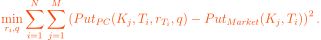

# Empirical study on the performance of exponential Lévy models against the Heston and Bates model, for pricing of European call options

## Abstract

We provide a survey for two models in the class of infinite activity (IA) exponential Lévy models namely, the Variance-Gamma (VG) model and the CGMY model, to analyze how their simplistic nature fare against more complex models such as the Heston SV model and Bates stochastic volatility with jumps (SVJ) model. We provide a thorough theoretical introduction and calibrate each model across strikes and maturities. The conclusion is twofold: First, the exponential Lévy models under analysis have a hard time calibrating across maturities due to a combination of the floating smile property and the decay in skew and kurtosis, thus leading to an underpricing of long-term OTM options. For short-term options, they over-compensate the skew, therefore leading to an overpricing of the short-term options. Secondly, the Heston and Bates model capture the market surface considerably better due to the increased complexity and the incorporated stylized properties of the asset returns, described above.

### Recovering the interest rate and dividend yield

Recovering of interest rates and dividend yield was done in R. The basic way to recover both from the option-chain was:

* Select a number of ATM calls for all maturities.
* Compute prices of the put options using put-call parity.
* Now we choose the interest rates *r* and dividend yield *q* such that we minimize the squarred error between the market put prices and the put option prices recovered from the put-call parity:



where *N* is the number of maturities and *M* is the number of put options. 

We follow in the style of [Carr \& Madan (2005)](https://engineering.nyu.edu/sites/default/files/2018-09/CarrFinResearchLetters2005.pdf) filtering out options that violate the no-arbitrage bounds by excluding static arbitrage formed by spread strategies. Let  denote the mid quote for a call of strike , then the call needs to satisfy the bounds:


where  and the last three bounds are derived from the cost of a vertical spread, butterfly spread and a calendar spread, respectively.

### Pricing of European call options.       

From standard pricing theory we know that analytical pricing formulas for options arise, when integrating the payoff over the density of the stock price process. However closed-form solutions for the density is often not available and thus we exploit the fact that the addressed models have closed-form characteristic functions, which provide the necessary condition to use Fourier pricing methods and recover the European call prices used in the calibration procedure. 

For the CGMY model we used the Fourier pricing teqnique of [Lewis (2001)](https://papers.ssrn.com/sol3/papers.cfm?abstract_id=282110), which meant that we had to use the characteristic function for the standardized stock price process. That is, divide by the discounted stock price on both sides. The characteristic function for the CGMY model is reduced to,


where 


and  being the standardized characteristic function of 


### The calibration procedure

Since the focus of my assignment revolved around comparing the fit of the implied volatility surface, it made sense to directly minimize the squared distance between the model implied vol and market implied vol: 


with Theta^* being the optimal parameters for the specified model that minimizes the 
sum of squared error. The calibration procedure was done by simultaneously fitting the implied volatility surface across strikes and maturities for all models. In more complex models such as the SVJ model, one could argue that we could have produced a better fit by calibrating the Heston dynamics, then the jump process and conclusively use these calibrated parameters as initial values for a final recalibration of the model. This is however not done in order to establish a fair framework for all models.

The corresponding MATLAB implementation involved using the build-in function *lsqnonlin* to find the optimal parameters that minimizes the above objective function. 

```matlab
S0 = 2663.60
VG = @(x) price_lewis_VG(S0vec, Strikes, maturities, ratessurf, dividend, x(1),x(2),x(3));


lossfunc_VG_impvol = @(x) blsimpv(S0, Strikes, ratessurf, maturities, Callsforcalibration,[],dividend)...
    - blsimpv(S0, Strikes, ratessurf, maturities, VG(x),[] ,dividend);


x0_VG = [0.0932    0.8050   -0.0986];

options_VG = optimoptions(@lsqnonlin, 'Display', 'iter', ...
    'MaxFunctionEvaluations', 5000, 'MaxIterations', 10000);

lbVG = [0, 0.0001, -inf];
upVG = [inf, inf, inf];

solution_VG_impvol=lsqnonlin(lossfunc_VG_impvol , x0_VG, lbVG, upVG, options_VG);

```

### Assessment of the calibration procedure

 To assess the performance of the calibration, we utilize different accuracy measures involving prices and implied volatilities.

 
 
 

The motivation for using both accuracy measures is that mean squared error is scale-dependent, and thus are more sensitive to outliers. Mean absolute percentage error is less senitive and also provides us with a percentage deviation from the true data, which is easier to interpret. Lastly, we do not want to have any preferential treatment to the mean squared error, therefore including another accuracy measure.

### The implied volatility surfaces 

Below you see the implied volatility surfaces for the calibrated models. The discussion of the findings can be found in my assignment (see pdf in this repository).


### Calculating the ATM implied volatility skew

From the Lewis approach, we can derive an equation to efficiently compute the term structure of the ATM volatility skew. Recovering the implied volatility can be done by equating the model call prices against the Black-Scholes call prices and solve for sigma. Now subtract the BS price on both sides,

 

then [Gatheral (2011)](https://books.google.dk/books?hl=da&lr=&id=P7ASlvLRsKMC&oi=fnd&pg=PT11&dq=gatheral+2011&ots=JgcVLzvlxA&sig=-YhwlM-oIGtt3T8dpDYvBSpsnVo&redir_esc=y#v=onepage&q=gatheral%202011&f=false) shows that differentiating with respect to *k* and evaluating at *k*=0 yields the ATM implied volatility skew:

 

The above formula gives us no way to recover the market skew. Therefore I supplemented the skew analysis with a central finite difference method on the ATM vol skew for the market and models in order to ensure a better comparison analysis. Essentially it was done by,


This produced the plot (see discussion of plot in assignment),


The MATLAB code for calculating the ATM implied volatility skew essentially looked like this:


```matlab
VG1 = price_lewis_VG(S0,[2662.7;2662.9],Maturities(1),rates(1),dividend(1),x0_VG(1),x0_VG(2),x0_VG(3))
VG2 = price_lewis_VG(S0,[2662.7;2662.9],Maturities(2),rates(2),dividend(1),x0_VG(1),x0_VG(2),x0_VG(3))
VG3 = price_lewis_VG(S0,[2662.7;2662.9],Maturities(3),rates(3),dividend(1),x0_VG(1),x0_VG(2),x0_VG(3))
VG4 = price_lewis_VG(S0,[2662.7;2662.9],Maturities(4),rates(4),dividend(1),x0_VG(1),x0_VG(2),x0_VG(3))
VG5 = price_lewis_VG(S0,[2662.7;2662.9],Maturities(5),rates(5),dividend(1),x0_VG(1),x0_VG(2),x0_VG(3))
VG6 = price_lewis_VG(S0,[2662.7;2662.9],Maturities(6),rates(6),dividend(1),x0_VG(1),x0_VG(2),x0_VG(3))

impvol_skew_VG1 = blsimpv(S0, [2662.7;2662.9], rates(1), Maturities(1), VG1,[], dividend(1));  
impvol_skew_VG2 = blsimpv(S0, [2662.7;2662.9], rates(2), Maturities(2), VG2,[], dividend(1));  
impvol_skew_VG3 = blsimpv(S0, [2662.7;2662.9], rates(3), Maturities(3), VG3,[], dividend(1));  
impvol_skew_VG4 = blsimpv(S0, [2662.7;2662.9], rates(4), Maturities(4), VG4,[], dividend(1));  
impvol_skew_VG5 = blsimpv(S0, [2662.7;2662.9], rates(5), Maturities(5), VG5,[], dividend(1));  
impvol_skew_VG6 = blsimpv(S0, [2662.7;2662.9], rates(6), Maturities(6), VG6,[], dividend(1));  

VG_before = [impvol_skew_VG1(1); impvol_skew_VG2(1);impvol_skew_VG3(1);impvol_skew_VG4(1);impvol_skew_VG5(1);impvol_skew_VG6(1)]
VG_after = [impvol_skew_VG1(2);impvol_skew_VG2(2);impvol_skew_VG3(2);impvol_skew_VG4(2);impvol_skew_VG5(2);impvol_skew_VG6(2)]
deltak_VG = repmat(log(2662.9/S0)-log(2662.7/S0),6,1);

fdd_VG = (VG_after - VG_before)./deltak_VG;

```

### Conclusion 

*Taken from assignment:* We constructed a survey for the performance of two ordinary exponential Lévy models against two well-known SV/SVJ-type models to observe how they fare against complex models. Through the extensive theoretical introduction we establish ways to price both families of models using characteristic functions and Fourier pricing methods. Moreover, we establish a theoretical base of reasons why the exponential Lévy models fail to fully capture the market surface (besides the lack of parameters), which is further strengthened in the empirical analysis. In order to provide the best fit possible we removed static arbitrage strategies as done in \cite{carr2005note}, and calibrated directly to the implied volatilities instead of the classical method of calibrating to the call prices. We conclude that due to the fast decay in skew and kurtosis for any exponential Lévy model whatsoever, it will not be able to fit the long-term implied volatility surface of the market. Of course, in hindsight to making this assignment it could have been more feasible to test whether the VG model with stochastic volatility induced via time-change - thus eliminating moment decays through leverage effect - provided a better fit to the surface and conclusively whether it could contest the benchmark models. Moreover, due to the simplicity of both exponential Lévy models\footnote{In order to alleviate confusion "simplicity" in the amount of parameters to fit the market surface: The VG and CGMY model have 3 and 4 parameters to calibrate versus 5 and 8 for the Heston and Bates model respectively.} they are inconsistent in capturing the short-term market skew when trying to accommodate the entire term-structure of the surface. 
